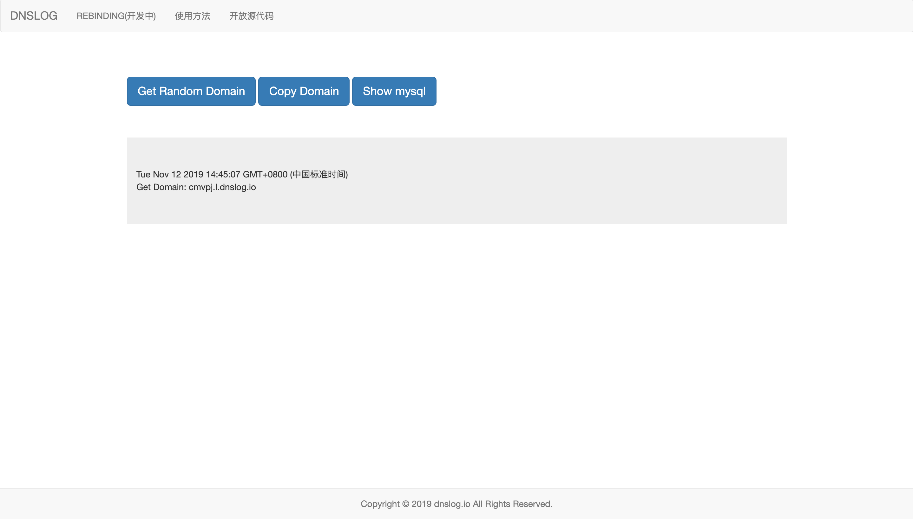

# DNSLOG



## deploy

install nodejs and npm
https://nodejs.org/en/download/

```
git clone https://github.com/hackit-me/dnslog
cd dnslog
npm install
cp config.js.example config.js
cp db/data.db.example db/data.db
# edit config.js
node app.js
```

set dns record
`set ns record to your webserver`

|subdomain|type|value|
|---|---|---|
|l.dnslog.io|ns|dnslog.io|

数据库结构
```
create table dnslog_user (
	id INTEGER primary key AUTOINCREMENT,
	username text,
	email text,
	avatar_url text,
	subdomain text,
	token text
)

create table dnslog_log (
	id INTEGER primary key AUTOINCREMENT,
	dnslog text,
	inserttime text,
	ip text,
	userid int
)
```